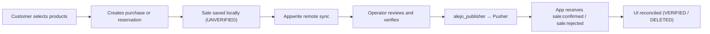

The AlejoTaller Android client app (`app/`) is the primary mobile surface for end customers in the AlejoTaller monorepo. It gives shoppers a complete electronics store experience — from browsing the product catalog and selecting items by category through completing a purchase or reservation — all while remaining functional under unreliable connectivity thanks to its offline-first architecture.

## Role in the Monorepo

The monorepo hosts four distinct surfaces that cooperate to deliver a single business flow:

| Surface | Module | Primary Role |
|---|---|---|
| Android Client | `app/` | Customer shopping, purchase, and verification |
| Android Operator | `alejotallerscan/` | QR scanning, sale confirmation and rejection |
| Web Client | `web/` | Browser-based shopping and APK download guidance |
| Publisher Function | `function/alejo_publisher/` | Secure Pusher event relay |

The Android client occupies the customer-facing end of this chain. It is the surface that initiates sales, persists them locally, and ultimately receives real-time feedback once an operator processes each order.

## Key Responsibilities

- **Authentication and session management** — email/password login, account creation, and optional Google Sign-In via Appwrite, with session persistence across app restarts.
- **Catalog browsing** — observe and filter products by category, with local Room cache ensuring the catalog is available offline.
- **Purchase and reservation** — create a new sale as either a direct purchase or a reservation, with DeliveryType selection (`PICKUP` or `DELIVERY`) after the order is confirmed.
- **Offline-first persistence** — sales and catalog data are saved locally first; remote synchronisation with Appwrite proceeds when connectivity is available.
- **Real-time verification events** — subscribe to a per-user Pusher channel (`sale-verification-{userId}`) and reconcile the local sale state when `sale:confirmed` or `sale:rejected` events arrive.

## Tech Stack

The client app is built entirely in Kotlin and targets Android API 26+.

```text
Kotlin                  — language
Jetpack Compose         — declarative UI
Material 3              — design system
Room                    — local SQLite persistence (offline-first)
Koin                    — dependency injection
Coroutines + StateFlow  — async work and reactive UI state
Appwrite Kotlin SDK     — authentication and remote data
Pusher Java Client      — real-time sale verification events
Ktor Client             — HTTP calls (payment gateway, publisher)
Coil                    — network image loading
```

## Shared Modules

The app avoids duplicating critical business logic by consuming four shared Gradle modules:

- **`shared-auth`** — authentication contracts, user roles, and session utilities shared with the operator app.
- **`shared-core`** — cross-cutting rules, notification entities, and transversal utilities.
- **`shared-data`** — DTOs, mappers, repositories, and data-layer support for persistence and sync.
- **`shared-sale`** — the complete sale domain: `Sale`, `BuyState`, `DeliveryType`, `Currency` enums, and all sale-related use cases including real-time event handling.

## The Sale Flow (Customer Perspective)

The main business flow seen by the customer unfolds in five steps:



1. The customer fills a cart and submits a purchase or reservation.
2. The sale is immediately persisted locally with `BuyState.UNVERIFIED`.
3. The app syncs the sale to Appwrite when connectivity allows.
4. The operator app (`alejotallerscan`) picks up the pending sale, verifies it, and triggers the `alejo_publisher` function.
5. The publisher relays a `sale:confirmed` or `sale:rejected` event to Pusher.
6. The Android client's Pusher subscription receives the event, updates the local `BuyState` to `VERIFIED` or `DELETED`, and surfaces in-app feedback to the customer.

<Note>
The `alejo_publisher` function is the exclusive Pusher publisher. Pusher secrets never live inside the Android APK, keeping the signing flow auditable and the release build secure.
</Note>

## Architecture Pattern

Every feature in the app follows the same three-layer structure:

```text
feature/{name}/
├── data/       — DAOs, DTOs, mappers, repository implementations
├── domain/     — entities, repository contracts, use cases
├── presentation/ — ViewModels (StateFlow), Compose screens, UI models
└── di/         — Koin module bindings
```

ViewModels expose immutable `StateFlow` states with explicit loading, error, and success variants, reducing visual coupling and making each screen predictable under all network conditions.

## Related Pages

<CardGroup cols={2}>
  <Card title="Feature Set & Use Cases" icon="list-check" href="/apps/android-client/features">
    Detailed breakdown of every feature module and its use cases.
  </Card>
  <Card title="Build & Run" icon="hammer" href="/apps/android-client/build-and-run">
    Prerequisites, Gradle commands, and local.properties configuration.
  </Card>
</CardGroup>
