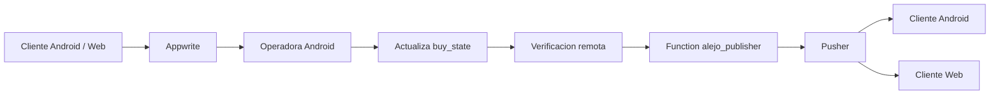

AlejoTaller is organised as a single monorepo that spans two Android applications, a Svelte web client, and a Node microservice, all sharing a common architectural language. Every surface follows the same feature-first, layered decomposition and relies on shared Kotlin modules for business-critical logic — so changes to the sale domain, authentication contracts, or mapper rules propagate consistently without manual duplication.

<Note>
  Offline-first is a **first-class design constraint**, not an afterthought. Every surface that touches purchase or reservation data is built to write locally first, reconcile with Appwrite when connectivity allows, and consume real-time Pusher events to reduce perceived latency between actors. This principle shapes both the module boundaries and the repository contracts throughout the codebase.
</Note>

## Monorepo Structure

```text
AlejoTaller/
├── app/                     # Android client (customer-facing)
├── alejotallerscan/         # Android operator (QR scanning, verification)
├── web/                     # Svelte web client
├── function/
│   └── alejo_publisher/     # Node/TypeScript Pusher publisher microservice
├── shared-auth/             # Shared authentication and role contracts
├── shared-core/             # Cross-cutting rules and utilities
├── shared-data/             # DTOs, mappers, repositories, persistence support
├── shared-sale/             # Sale domain — entities, states, use cases
├── mapper-processor/        # Annotation-based mapper processing support
├── build.gradle.kts
├── settings.gradle.kts
└── local.properties
```

The Gradle settings file explicitly includes every module:

```kotlin
// settings.gradle.kts
rootProject.name = "AlejoTaller"
include(":app")
include(":mapper-processor")
include(":alejotallerscan")
include(":shared-core")
include(":shared-auth")
include(":shared-sale")
include(":shared-data")
```

## Feature-First Layered Structure

Both Android applications organise code by feature rather than by layer. Inside each feature, the same three-layer structure applies consistently.

```text
feature/{feature}/
├── data/
│   ├── dao/          # Room DAO interfaces (local persistence)
│   ├── dto/          # Data Transfer Objects for remote serialisation
│   ├── mapper/       # Bidirectional transformations: DTO ↔ entity
│   └── repository/   # Concrete repository implementations
├── domain/
│   ├── caseuse/      # One use case per significant action
│   ├── entity/       # Immutable domain entities
│   └── repository/   # Repository contracts (interfaces)
├── presentation/
│   ├── model/        # UI state models
│   ├── screen/       # Jetpack Compose screens and navigation routes
│   └── viewmodel/    # ViewModels exposing StateFlow<UiState>
└── di/               # Koin module definitions for this feature
```

This layout is the same architectural language used across `app/`, `alejotallerscan/`, and — conceptually — the equivalent Svelte feature directories in `web/`.

## Six Architectural Patterns

### 1. Offline-First Reconciliation

All purchase and reservation flows prioritise local persistence before remote confirmation. The system:

- writes to the local Room database (or IndexedDB on web) immediately
- synchronises with Appwrite when connectivity is available
- maintains a pending sync queue for operations that could not be pushed immediately
- merges remote and local state without losing user context

This means the apps remain fully usable during intermittent connectivity and catch up automatically when the network returns.

### 2. Repository Pattern

Repository classes act as the single point of data access for each feature. They:

- abstract local (Room / Dexie) access from domain logic
- abstract remote (Appwrite SDK) access from domain logic
- own the synchronisation and retry rules
- translate between DTOs (remote/local schema) and domain entities

The domain layer only ever interacts with repository interfaces defined under `domain/repository/`, never with concrete data-layer types.

### 3. Use Case Per Action

Business logic is neither placed in ViewModels nor in large, multi-purpose repositories. Each meaningful action in the domain is encapsulated in its own use case class under `domain/caseuse/`. Representative examples from the codebase include:

- authenticate user
- register a new sale
- interpret an incoming real-time event
- synchronise pending operator decisions
- enrich product data after a QR scan

This keeps ViewModels thin and makes business rules independently testable.

### 4. Immutable UI State (StateFlow)

ViewModels expose a single `StateFlow<UiState>` that the Compose UI observes. The state object is immutable and carries explicit fields for every condition the screen must handle:

- `loading` — whether an async operation is in progress
- `selectedItem` — currently focused domain entity
- `error` — actionable error message
- `notice` — transient informational feedback
- `syncStatus` — local/remote reconciliation status

Composables collect the flow and render declaratively, with no hidden mutable side-effects.

### 5. Shared Domain Modules

The four `shared-*` modules prevent logic from diverging between the Android client and the Android operator as the product grows.

| Module | Contains |
|---|---|
| `shared-auth` | Auth session management, role definitions, operator access contracts |
| `shared-core` | Cross-cutting utilities and commonly reused rules |
| `shared-data` | DTOs, mapper support, base repository implementations, persistence helpers |
| `shared-sale` | Sale entity, `buy_state` transitions, sale use cases |

Both `app` and `alejotallerscan` depend on these modules via Gradle. Any change to the sale domain propagates to both consumers without manual synchronisation.

### 6. Event-Driven Feedback

Sale verification does not rely on polling. Once the operator's Android app confirms or rejects a reservation, the following sequence delivers the outcome to all subscribers in real time:



1. The customer (Android or web) creates a purchase or reservation in Appwrite.
2. The operator Android app reads the pending reservation and makes a decision.
3. The operator app updates `buy_state` in Appwrite and verifies the remote change was applied.
4. Only after remote confirmation does the app call `POST /sale-verification/publish` on `alejo_publisher`.
5. The publisher translates the decision into a `sale:confirmed` or `sale:rejected` Pusher event on the user-specific channel `sale-verification-{userId}`.
6. Both the Android client and the Svelte web client are subscribed to that channel and update their UI immediately.

This design keeps Pusher secrets out of the APK, avoids timestamp-signing problems that arise from mobile clock drift, and ensures no event is published when the Appwrite state was not actually updated.

## Offline-First Reconciliation in Detail

The reconciliation cycle works as follows:

| Stage | What happens |
|---|---|
| **Local write** | The operation is persisted to Room (Android) or Dexie/IndexedDB (web) immediately |
| **Remote push** | The repository attempts to push to Appwrite; on failure the item enters the pending sync queue |
| **Pending queue** | The app retries failed pushes when connectivity is restored, using the stored local record |
| **Remote pull** | On app resume or network recovery, the repository fetches the latest remote state |
| **Merge** | Local and remote records are compared; the repository applies the reconciliation strategy for each feature |
| **UI update** | The `StateFlow` emits the reconciled entity and the screen reflects the final state |

The operator app additionally maintains a separate internal history so that the operator's record of decisions is always available locally, regardless of whether the Appwrite sync completed.

## How Shared Modules Prevent Divergence

Without the `shared-*` modules, the sale entity, its valid state transitions, and the authentication session model would need to be defined independently in both Android apps. Any change — such as adding a new `buy_state` value or a new field to the sale entity — would require identical updates in two places, with no compile-time guarantee they stay in sync.

By placing these definitions in dedicated Gradle modules that both apps depend on, a compile error in either app immediately surfaces any inconsistency. The shared modules are the technical enforcer of the product invariant: *one same domain, multiple surfaces*.
