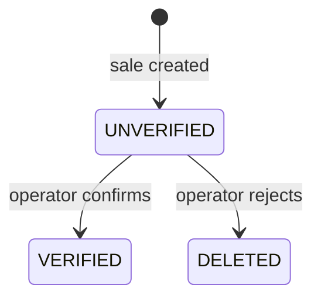

A sale in AlejoTaller travels through four distinct stages before it is resolved: the customer creates an order, the operator reviews and decides, the publisher microservice fires a Pusher event, and the client app applies the result to its local state. Each stage is handled by a dedicated layer — use cases, repositories, and realtime infrastructure — so that a failure in one stage does not silently corrupt another.

---

## BuyState Transitions

Every sale carries a `verified` field whose value is one of three states defined in the shared `BuyState` enum:

```typescript
export enum BuyState {
    UNVERIFIED = "UNVERIFIED",
    VERIFIED   = "VERIFIED",
    DELETED    = "DELETED"
}
```

On Android the same enum lives in the shared-sale module:

```kotlin
enum class BuyState { UNVERIFIED, VERIFIED, DELETED }
```



A sale can only move forward — there is no path from `VERIFIED` or `DELETED` back to `UNVERIFIED`.

---

## Complete Sequence

```mermaid
flowchart TD
    A[Customer adds items to cart] --> B[RegisterNewSaleCaseUse / RegisterNewSaleCauseUse]
    B --> C[Sale.verified = UNVERIFIED]
    C --> F[Send Telegram notification]
    F --> D[Save to Room / Dexie and push to Appwrite]
    D --> G[Operator app loads pending sales from Appwrite]
    G --> H{Operator decision}
    H -->|confirm| I[Update buy_state → VERIFIED on Appwrite]
    H -->|reject|  J[Update buy_state → DELETED on Appwrite]
    I --> K[Verify Appwrite confirmed the change]
    J --> K
    K --> L[POST /sale-verification/publish to alejo_publisher]
    L --> M[PusherSaleRealtimePublisher triggers event on sale-verification-userId]
    M --> N[sale:confirmed or sale:rejected event fires]
    N --> O[Android / web client receives event]
    O --> P[InterpretSaleRealtimeEventCaseUse → SaleRealtimeCommand list]
    P --> Q[UpdateSaleVerificationFromRealtimeCaseUse → update Room / Dexie]
    Q --> R[StateFlow / Svelte store emits new state]
    R --> S[UI re-renders with confirmation or rejection feedback]
```

---

## Stage 1: Order Creation

<Steps>
  <Step title="Customer builds the cart">
    The customer selects products and quantities. The `Sale` entity is constructed with all required fields:

    ```typescript
    export interface Sale {
        id: string
        date: string          // ISO string
        amount: number
        verified: BuyState    // starts as UNVERIFIED
        products: SaleItem[]
        currency: Currency    // CUP | USD | MLC
        userId: string
        deliveryType?: DeliveryType | null  // PICKUP | DELIVERY
        deliveryAddress?: DeliveryAddress | null
    }
    ```

    Kotlin equivalent in the shared domain module:

    ```kotlin
    @Serializable
    data class Sale(
        val id: String,
        val date: LocalDate,
        val amount: Double,
        val currency: Currency,      // CUP, USD, MLC
        val verified: BuyState,      // starts as UNVERIFIED
        val products: List<SaleItem>,
        val userId: String,
        val customerName: String? = null,
        val deliveryType: DeliveryType? = null,   // PICKUP or DELIVERY
        val deliveryAddress: DeliveryAddress? = null
    )
    ```
  </Step>

  <Step title="RegisterNewSaleCauseUse assigns an ID and notifies">
    On Android and in the shared-sale module, `RegisterNewSaleCauseUse` orchestrates the creation:

    ```kotlin
    class RegisterNewSaleCauseUse(
        private val repository: SaleRepository,
        private val saleIdProvider: SaleIdProvider,
        private val notificationUserProvider: SaleNotificationUserProvider,
        private val telegramNotificator: TelegramNotificator
    ) {
        suspend operator fun invoke(sale: Sale): Result<String> = runCatching {
            val saleConfirmed = sale.copy(id = saleIdProvider.nextId())

            val user = notificationUserProvider
                .getCurrentUser()
                .getOrElse { throw Exception("Transfer fail") }

            telegramNotificator.notify(saleConfirmed, user)  // Telegram alert first

            repository.save(saleConfirmed)                    // then persist

            saleConfirmed.id
        }
    }
    ```

    `saleIdProvider.nextId()` generates the Appwrite document ID before the save, so the same ID is used for both the local Room/Dexie record and the remote Appwrite document.
  </Step>

  <Step title="Telegram notification sent first">
    A Telegram message is dispatched via `TelegramNotificatorImpl` **before** the repository call in both web (`RegisterNewSaleCaseUse`) and Android (`RegisterNewSaleCauseUse`). This gives the business owner immediate visibility of new orders through a channel that does not require the operator app to be open.
  </Step>

  <Step title="Sale persisted and pushed to Appwrite">
    On **Android**, `SaleOfflineFirstRepository.save()` writes to Room first, then attempts the remote push with up to three retries — a network failure leaves the sale in `UNVERIFIED` state locally and it is reconciled by the next `SyncSalesCaseUse` invocation. On **web**, `SaleOfflineFirstRepository.create()` calls the Appwrite remote first; on success the returned document is cached in Dexie. If the remote call fails, the error is thrown — there is no local-only fallback for web sale creation.
  </Step>
</Steps>

<Note>
The `products` field is serialized as a string when stored in Appwrite. This is a known data-modelling decision acknowledged in the README as technical debt: *"el esquema remoto arrastra decisiones de modelado mejorables como `products` serializado como string."* The local Room and Dexie stores hold the structured list; the string encoding only appears in the DTO layer exchanged with Appwrite.
</Note>

---

## Stage 2: Operator Processing

<Steps>
  <Step title="Operator loads pending sales">
    The operator app (AlejoTallerScan) fetches all sales from Appwrite on launch or on manual refresh. Sales in `UNVERIFIED` state are surfaced as the active work queue.
  </Step>

  <Step title="Operator identifies the order">
    The operator either scans the customer's QR code (using CameraX + ML Kit Barcode Scanning) or selects the sale manually from the list.
  </Step>

  <Step title="Operator makes a decision">
    The operator confirms or rejects. The app updates `buy_state` on Appwrite:

    - Confirm → `buy_state = VERIFIED`
    - Reject  → `buy_state = DELETED`
  </Step>

  <Step title="Appwrite response is verified">
    The flow does not continue unless Appwrite confirms the document was updated with the expected `buy_state` value. This verification step prevents a phantom confirmation event from reaching the customer if the Appwrite write failed silently.
  </Step>

  <Step title="alejo_publisher is called">
    Only after Appwrite confirms the state change does the operator app call:

    ```
    POST /sale-verification/publish
    Authorization: Bearer <PUBLISHER_API_KEY>

    {
      "saleId": "abc123",
      "userId": "user456",
      "decision": "confirmed",
      "amount": 1500,
      "productCount": 3
    }
    ```
  </Step>
</Steps>

<Warning>
If the call to `alejo_publisher` fails (network error, server down), the Appwrite record is already updated but the Pusher event is never fired. The customer will not receive a realtime notification. The sale state will still be correct in Appwrite and will be reconciled on the next sync — but the real-time UX for that customer will be degraded. This is a known gap for a future hardening pass.
</Warning>

---

## Stage 3: Event Publishing

<Steps>
  <Step title="alejo_publisher receives the command">
    The Express server validates the request with a Bearer token check, then passes the body to `PublishSaleVerificationUseCase.execute()`:

    ```typescript
    app.post("/sale-verification/publish", requireApiKey, async (req, res, next) => {
        const command = req.body as PublishSaleVerificationCommand
        const result = await publishSaleVerificationUseCase.execute(command)
        res.json({ ok: true, ...result })
    })
    ```
  </Step>

  <Step title="Command is validated">
    `validateCommand` checks that `saleId` and `userId` are non-empty strings and that `decision` is exactly `"confirmed"` or `"rejected"`. Any violation returns HTTP 400 before reaching Pusher.
  </Step>

  <Step title="PusherSaleRealtimePublisher fires the event">
    ```typescript
    const channel   = `sale-verification-${command.userId}`
    const eventName = command.decision === "confirmed"
        ? "sale:confirmed"
        : "sale:rejected"

    await this.pusher.trigger(channel, eventName, {
        saleId:       command.saleId,
        userId:       command.userId,
        decision:     command.decision,
        timestamp:    Date.now().toString(),
        amount:       command.amount ?? null,
        productCount: command.productCount ?? null,
        type:         eventName,
        cause:        command.cause ?? null
    })
    ```

    The response includes the resolved `channel` and `eventName` so the operator app can log or display confirmation.
  </Step>
</Steps>

---

## Stage 4: Client Update

<Steps>
  <Step title="Client receives the Pusher event">
    Both the Android client and the web client maintain an active Pusher subscription on channel `sale-verification-{userId}`. On Android, `PusherManager` binds a handler for `sale:confirmed` and `sale:rejected`:

    ```kotlin
    pusherManager.subscribe(
        channel    = saleChannel,   // "sale-verification-{userId}"
        eventNames = listOf("sale:confirmed", "sale:rejected"),
        onReceive  = { saleProcessor.process(it) }
    )
    ```
  </Step>

  <Step title="InterpretSaleRealtimeEventCaseUse generates commands">
    The raw event payload is parsed into a `SaleRealtimeEvent` by `SaleEventProcessor`, then passed to the interpreter:

    ```kotlin
    // success path
    listOf(
        SaleRealtimeCommand.InAppMessage(
            message = "Pedido ${event.saleId} confirmado",
            kind    = RealtimeMessageKind.Success
        ),
        SaleRealtimeCommand.PushNotification(
            title = "Pedido confirmado",
            body  = "Tu pedido ${event.saleId} fue confirmado"
        )
    )

    // failure path
    listOf(
        SaleRealtimeCommand.InAppMessage(
            message = "Pedido ${event.saleId} rechazado: ${event.cause ?: "sin detalles"}",
            kind    = RealtimeMessageKind.Error
        ),
        SaleRealtimeCommand.PushNotification(
            title = "Pedido con incidencia",
            body  = "Revisa el pedido ${event.saleId}"
        )
    )
    ```
  </Step>

  <Step title="UpdateSaleVerificationFromRealtimeCaseUse updates local state">
    ```kotlin
    val currentSale = repository.getById(saleId)
    val nextState   = if (isSuccess) BuyState.VERIFIED else BuyState.DELETED
    if (currentSale.verified == nextState) return@runCatching  // idempotent guard

    repository.save(currentSale.copy(verified = nextState))
    ```

    On Android this writes to Room. On the web client, the equivalent `updateVerified` call writes to Dexie. Both paths are idempotent — receiving the same event twice produces the same local state.
  </Step>

  <Step title="UI reacts automatically">
    Android ViewModels expose `StateFlow<UiState>` derived from Room flows via `SaleDao.getAllFlow()`. When Room emits an updated list, the StateFlow carries the change to Compose, which recomposes the relevant screen without any manual trigger.

    On the web, Svelte stores subscribed to the Dexie query re-render the sale status component, surfacing the confirmation or rejection feedback to the customer.
  </Step>
</Steps>

---

## Currency and Delivery Options

The sale entity supports three currencies and two delivery modes, encoded as enums on both platforms:

```typescript
export enum Currency {
    CUP = "CUP",
    USD = "USD",
    MLC = "MLC"
}

export enum DeliveryType {
    PICKUP   = "PICKUP",   // customer collects from the workshop
    DELIVERY = "DELIVERY"  // workshop coordinates home delivery
}
```

`DeliveryType` is set at order creation time and can be updated after verification via `UpdateDeliveryTypeCaseUse`. When `DELIVERY` is chosen, a `DeliveryAddress` object (province, municipality, streets, phone, house number) is attached to the sale.

---

## Stage Summary

| Stage | Actor | Key operation | Failure mode |
|---|---|---|---|
| Order Creation | Customer | `RegisterNewSaleCauseUse` → local save → Appwrite push | Sale stays local; synced later |
| Operator Processing | Operator | Update `buy_state` on Appwrite; verify response | Flow halts; no Pusher event |
| Event Publishing | `alejo_publisher` | `PusherSaleRealtimePublisher.publishSaleVerification()` | Customer misses realtime notification |
| Client Update | Android / Web | `UpdateSaleVerificationFromRealtimeCaseUse` → Room/Dexie | UI may lag; state corrects on next sync |

<Tip>
The sale ID is allocated by `SaleIdProvider` (backed by Appwrite document ID generation) before `save()` is called. This means the local Room/Dexie record and the Appwrite document share the same identifier from the moment of creation, making reconciliation during sync a straightforward upsert-by-ID.
</Tip>
